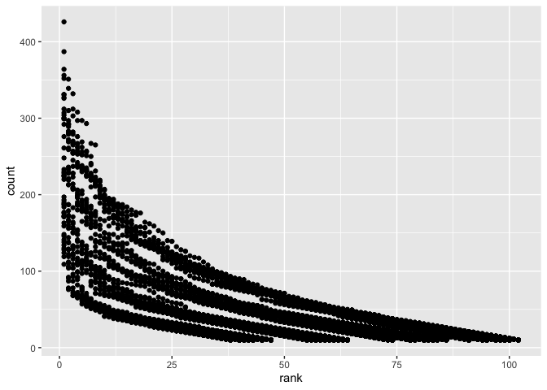

p8105\_hw2\_qy2234
================
Michael Yan
9/25/2019

## Problem 1

``` r
## load the tidyverse and readxl package
library(tidyverse)
```

    ## ── Attaching packages ─────────────────────────────────────────────────────── tidyverse 1.2.1 ──

    ## ✔ ggplot2 3.2.1     ✔ purrr   0.3.2
    ## ✔ tibble  2.1.3     ✔ dplyr   0.8.3
    ## ✔ tidyr   1.0.0     ✔ stringr 1.4.0
    ## ✔ readr   1.3.1     ✔ forcats 0.4.0

    ## ── Conflicts ────────────────────────────────────────────────────────── tidyverse_conflicts() ──
    ## ✖ dplyr::filter() masks stats::filter()
    ## ✖ dplyr::lag()    masks stats::lag()

``` r
library(readxl)

## import data and specify the sheet in the Excel file and to omit non-data entries
tw_data = 
  read_excel(
  "./P1_data/Trash-Wheel-Collection-Totals-8-6-19.xlsx", sheet = 1) %>%
  janitor::clean_names() %>% 
  select(-x15,-x16, -x17) %>% 
  drop_na(dumpster) %>%
  select(dumpster, month, year, everything()) %>% 
  mutate(sports_balls = as.integer(sports_balls))
```

    ## New names:
    ## * `` -> ...15
    ## * `` -> ...16
    ## * `` -> ...17

``` r
## read and clean precipitation data for 2017 and 2018

## import and clear 2017 data
tw_data_17 = read_excel(
  "./P1_data/Trash-Wheel-Collection-Totals-8-6-19.xlsx", 
  sheet = 6, skip = 1) %>%
  janitor::clean_names() %>% 
  drop_na(total) %>% 
  mutate(year = "2017") %>% 
  rename(percipitation_in_in = total)

## import and clear 2018 data
tw_data_18 = read_excel(
  "./P1_data/Trash-Wheel-Collection-Totals-8-6-19.xlsx", 
  sheet = 5, skip = 1) %>%
  janitor::clean_names() %>% 
  drop_na(total) %>% 
  mutate(year = "2018") %>% 
  rename(percipitation_in_in = total)

## combine 2017 2018 data
tw_data_17_18 = 
  left_join(tw_data_17, tw_data_18, by = "month") %>% 
  drop_na(month) %>%
  mutate(month = month.name)
```

#### Question\_one\_description

  - The number of observations in tw\_data is 344
  - The number of observations in tw\_data\_17\_18 is 12
  - Some key variables in tw-data include dumpster, month, and year
  - Some key variables in tw\_data\_17\_18 include month, year
  - The total precipitation in 2018 is 70.33
  - The median number of sports balls in a dumpster in 2017 is 172.5

## Problem 2

``` r
## load the tidyverse and readxl package
library(tidyverse)
library(readxl)

## import and clean the data in pols-month.csv
pols_month_data = read_csv(
  "./P2_data/fivethirtyeight_datasets/pols-month.csv") %>% 
  janitor::clean_names() %>% 
  separate(mon, c("year", "month", "day"), convert = TRUE) %>% 
  mutate(month = month.abb[month]) %>% 
  mutate(month = str_to_lower(month)) %>% 
  pivot_longer(gov_gop:rep_gop, 
               names_to = "gop_groups",
               values_to = "count_gop") %>% 
  pivot_longer(gov_dem:rep_dem, 
               names_to = "dem_groups",
               values_to = "count_dem") %>% 
  pivot_longer(prez_gop:prez_dem, 
               names_to = "president",
               values_to = "prez_gop_or_dem") %>% 
  select(-president, -day) %>% 
  rename(president = prez_gop_or_dem)
```

    ## Parsed with column specification:
    ## cols(
    ##   mon = col_date(format = ""),
    ##   prez_gop = col_double(),
    ##   gov_gop = col_double(),
    ##   sen_gop = col_double(),
    ##   rep_gop = col_double(),
    ##   prez_dem = col_double(),
    ##   gov_dem = col_double(),
    ##   sen_dem = col_double(),
    ##   rep_dem = col_double()
    ## )

``` r
## import and clean the data in snp.csv
snp_data = read_csv(
  "./P2_data/fivethirtyeight_datasets/snp.csv") %>% 
  janitor::clean_names() %>% 
  separate(date, c("month", "day", "year"), convert = TRUE) %>% 
  mutate(month = month.abb[month]) %>% 
  mutate(month = str_to_lower(month)) %>%
  arrange(year, month) %>% 
  select(year, month, day, close)
```

    ## Parsed with column specification:
    ## cols(
    ##   date = col_character(),
    ##   close = col_double()
    ## )

``` r
## import and clean the data in unemployment.csv
unemployment_data = read_csv(
  "./P2_data/fivethirtyeight_datasets/unemployment.csv") %>%
  janitor::clean_names() %>% 
  pivot_longer(
    jan:dec,
    names_to = "month", 
    values_to = "unemployment") 
```

    ## Parsed with column specification:
    ## cols(
    ##   Year = col_double(),
    ##   Jan = col_double(),
    ##   Feb = col_double(),
    ##   Mar = col_double(),
    ##   Apr = col_double(),
    ##   May = col_double(),
    ##   Jun = col_double(),
    ##   Jul = col_double(),
    ##   Aug = col_double(),
    ##   Sep = col_double(),
    ##   Oct = col_double(),
    ##   Nov = col_double(),
    ##   Dec = col_double()
    ## )

``` r
## join the datasets by merging snp into pols, and merging unemployment into the result
pols_snp = 
  left_join(pols_month_data, snp_data, by = "year")
pols_snp_unemployment = 
  left_join(pols_snp, unemployment_data, by = "year")
```

Write a short paragraph about these datasets. Explain briefly what each
dataset contained, and describe the resulting dataset (e.g. give the
dimension, range of years, and names of key variables).

#### Question\_two\_description

  - The pols\_month\_data contains the number of governors, senators,
    and representatives from both parties at a given time. The snp\_data
    provides the closing values of the S\&P stock index on the
    associated date. The unemployment\_data shows the percentage of
    unemployment in each month of the associated year. Finally, the
    pols\_snp\_unemployment dataset gives us a view of all the
    information associate with a given time point, including the number
    of governors, senators, and representatives from both parties, the
    S\&P stock index, and the percentage of unemployment. It also gives
    us the information about when the measurements were done (which
    month, or day, if applicabel).

The dimension of the final resulting dataset is 2036232 by 12

The range of years is 1947 - 2015

The names of key variables include year and month

## Problem 3

``` r
## import and clean the data in unemployment.csv
baby_name_data = read_csv(
  "./P3_data/Popular_Baby_Names.csv") %>%
  janitor::clean_names() %>% 
  mutate(gender = str_to_lower(gender)) %>% 
  mutate(ethnicity = str_to_lower(ethnicity)) %>% 
  mutate(childs_first_name = str_to_lower(childs_first_name)) %>% 
  distinct() %>% 
  mutate(ethnicity = recode(ethnicity, "asian and paci" = "asian and pacific islander")) %>%   mutate(ethnicity = recode(ethnicity, "black non hisp" = "black non hispanic")) %>%           mutate(ethnicity = recode(ethnicity, "white non hisp" = "white non hispanic")) %>% 
  mutate(ethnicity = factor(ethnicity))
```

    ## Parsed with column specification:
    ## cols(
    ##   `Year of Birth` = col_double(),
    ##   Gender = col_character(),
    ##   Ethnicity = col_character(),
    ##   `Child's First Name` = col_character(),
    ##   Count = col_double(),
    ##   Rank = col_double()
    ## )

``` r
## produce a well-structured, reader-friendly table for girl's name
baby_name_data_tidy_girl = 
  baby_name_data %>% 
  filter(childs_first_name == "olivia") %>% 
  select(-gender, -count) %>% 
  pivot_wider(
  names_from = "year_of_birth", 
  values_from = "rank") 
   

## produce a well-structured, reader-friendly table for boy's name
baby_name_data_tidy_boy = 
  baby_name_data %>% 
  filter(gender == "male", rank == "1") %>% 
  select(-gender, -count, -rank) %>% 
  pivot_wider(
  names_from = "year_of_birth", 
  values_from = "childs_first_name")
```

Produce a well-structured, reader-friendly table showing the rank in
popularity of the name “Olivia” as a female baby name over time; this
should have rows for ethnicities and columns for year. Produce a similar
table showing the most popular name among male children over
time.

``` r
## for male, white non-hispanic children born in 2016, produce a scatter plot
data_for_scatter_plot = 
  filter(baby_name_data, year_of_birth == 2016, gender == "male", 
         ethnicity == "white non hispanic")
ggplot(baby_name_data, aes(x = rank, y = count)) + 
  geom_point() + 
  labs(
    title = "Names for male, white non-hispanic children born in 2016",
    x = "Rank",
    y = "Count")
```

<!-- -->
